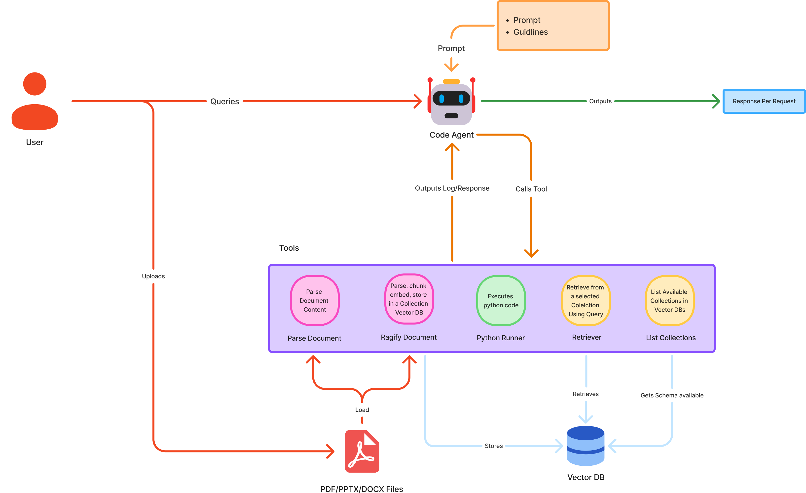
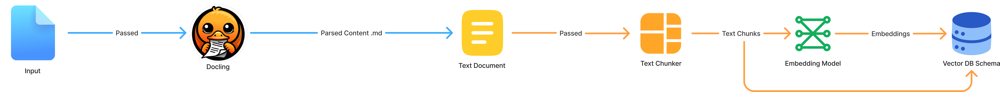

# 🤖 AutoRAGENT

**AutoRAGENT** is an autonomous knowledge assistant designed to interact with your documents intelligently. It leverages an agentic system powered by [smolagents](https://github.com/huggingface/smolagents) to perform complex tasks, from parsing and indexing documents to answering queries with code execution capabilities.

The system is built with a modern stack featuring **FastAPI**, **Streamlit**, **ChromaDB**, and **Docker**.

---

## 🏗️ System Architecture

The project follows a microservices architecture:

1.  **Frontend (Streamlit)**: A user-friendly chat interface that supports file uploads, displays the agent's "thought process" (coding steps), and visualizes the knowledge base.
2.  **Backend (FastAPI)**: The core logic hub. It hosts the autonomous agent, manages the RAG pipeline, and exposes REST endpoints.
3.  **Database (ChromaDB)**: A vector database that stores document embeddings for semantic retrieval.


---

## 🧠 Agent Architecture

AutoRAGENT uses a **CodeAgent** from the `smolagents` library. Unlike traditional chat bots, this agent can write and execute Python code to solve problems.

### Capabilities
-   **Tool Use**: The agent has access to specific tools to interact with the world.
-   **Reasoning**: It breaks down complex user requests into steps.
-   **Code Execution**: It can run Python code to perform calculations, data analysis, or call other tools.

### Available Tools
-   `ragify_document`: Ingests a document (PDF, etc.) into a specific collection in the vector database.
-   `parse_document`: Converts a document into structured Markdown with page numbers using `docling`.
-   `list_collections`: Lists all available knowledge base collections.
-   `query_collection`: Performs semantic search on a specific collection.
-   `PythonInterpreter`: Executes Python code safely.



---

## 🔄 RAG Pipeline (Ragify)

The "Ragify" process is the pipeline used to turn raw documents into searchable vector embeddings.

1.  **Ingestion**: The user uploads a file (PDF, PPTX, DOCX).
2.  **Parsing**: The `Parser` module (powered by `docling`) converts the document into a structured format.
3.  **Chunking**: The `Chunker` splits the document into semantic chunks to optimize retrieval.
4.  **Embedding & Storage**: The `VectorDBManager` embeds the chunks using `BAAI/bge-m3` (via HuggingFace) and stores them in **ChromaDB**.



---

## 🚀 Getting Started

### Prerequisites
-   **Docker** & **Docker Compose** (Recommended)
-   **Python 3.11** & **uv** (For manual setup)
-   **OpenAI API Key** (for the LLM)

### 1. Environment Setup

Create a `.env` file in the root directory. You can use the example below:

```ini
# .env
OPENAI_API_KEY=sk-proj-....
DATABASE_HOST=localhost        
DATABASE_PORT=1989
BACKEND_HOST=localhost        
BACKEND_PORT=2003
BACKEND_URL=http://localhost:2003
SESSIONS_FOLDER=apps/database/data/uploads
```


### 2. Run with Docker (Recommended)

This will start the Frontend, Backend, and Database services automatically.

```bash
docker-compose up --build
```

-   **Frontend**: [http://localhost:2001](http://localhost:2001)
-   **Backend API**: [http://localhost:2003/docs](http://localhost:2003/docs)
-   **ChromaDB**: [http://localhost:1989](http://localhost:1989)

### 3. Run Manually (No Docker)

If you prefer running services individually, you need to install `uv` first.

#### Database (ChromaDB)
You need a local ChromaDB instance running.
```bash
chroma run --host localhost --port 1989 --path ./apps/database/data
```

#### Backend
**Linux / macOS**
```bash
cd apps/backend
uv sync
export PYTHONPATH=$PYTHONPATH:$(pwd)/src
uv run src/api.py
```

**Windows (PowerShell)**
```powershell
cd apps/backend
uv sync
$env:PYTHONPATH = "$env:PYTHONPATH;$(Get-Location)\src"
uv run src/api.py
```
*Runs on port 2003*

#### Frontend
```bash
cd apps/frontend
uv sync
uv run streamlit run app.py --server.port 2001
```
*Runs on port 2001*

---

## 📂 Project Structure

```
AutoRAGENT/
├── apps/
│   ├── backend/            # FastAPI Application
│   │   ├── src/
│   │   │   ├── agent/      # Agent logic, tools, and prompts
│   │   │   ├── core/       # DBHandler, Parser, Chunker
│   │   │   ├── services/   # Ragify pipeline
│   │   │   └── api.py      # Main entry point
│   │   ├── Dockerfile
│   │   └── pyproject.toml
│   │
│   ├── frontend/           # Streamlit Application
│   │   ├── app.py
│   │   ├── Dockerfile
│   │   └── pyproject.toml
│   │
│   └── database/           # ChromaDB Data & Dockerfile
│       └── data/           # Persistent storage
│
├── docker-compose.yml      # Orchestration
└── README.md
└── .env
```

## 🛠️ Tech Stack

-   **LLM Orchestration**: [smolagents](https://github.com/huggingface/smolagents)
-   **Vector Database**: [ChromaDB](https://www.trychroma.com/)
-   **Document Parsing**: [Docling](https://github.com/DS4SD/docling)
-   **Backend Framework**: [FastAPI](https://fastapi.tiangolo.com/)
-   **Frontend Framework**: [Streamlit](https://streamlit.io/)
-   **Package Manager**: [uv](https://github.com/astral-sh/uv)
---

## 👥 Authors

-   [Ouassim HAMDANI](https://www.linkedin.com/in/ouassim-hamdani/)
-   [Malissa NASRI](https://www.linkedin.com/in/malissa-nasri/)
### 🌟 Special Thanks

A huge shoutout to our support team (who definitely did not contribute code but kept the vibes immaculate):

-   🎤 **Taylor Swift** – For the debugging playlists.
-   🏎️ **Lewis Hamilton** – For teaching us how to race against deadlines.
